# Azure DNS Infrastructure Testing Lab

[](https://opensource.org/licenses/MIT)
[](https://portal.azure.com/#create/Microsoft.Template/uri/https%3A%2F%2Fraw.githubusercontent.com%2Fkelomai%2Fazure-private-dns-lab%2Fmain%2Fazuredeploy.json)

A complete, open-source Azure lab environment for testing DNS infrastructure scripts, featuring a hub-spoke network with Active Directory, Azure DNS Private Resolver, and Private Endpoints.

**This project is open source under the MIT License.** Contributions, issues, and feedback are welcome!

## 📖 Documentation

**Start here:** [Complete Guide (docs/GUIDE.md)](docs/GUIDE.md) - Everything you need to deploy and test the lab

**Technical details:** [Technical Notes (docs/TECHNICAL-NOTES.md)](docs/TECHNICAL-NOTES.md) - Implementation details and design decisions

## Quick Start

### Option 1: Deploy to Azure Button

Click the **Deploy to Azure** button above to deploy directly from the Azure Portal. You'll be prompted to:

1. Select your subscription and resource group
2. Choose a location (e.g., `eastus`)
3. Set an admin password for the VMs
4. Click **Review + Create**

### Option 2: PowerShell Script

Clone the repo and run the deployment script:

```powershell
git clone https://github.com/kelomai/azure-private-dns-lab.git
cd azure-private-dns-lab
./Deploy-TestEnvironment.ps1 -ResourceGroupName "rg-dnstest" -Location "eastus"
```

**Time:** ~30-40 minutes | **Cost:** ~$280/month

After deployment:
1. Save the displayed password
2. Connect to VMs via Azure Bastion (Azure Portal → VM → Connect → Bastion)
3. Run DNS tests (see complete guide)

## What Gets Deployed

```mermaid
graph TB
    subgraph Internet
        User[👤 User]
    end

    subgraph Azure["Azure Cloud"]
        subgraph HubVNet["Hub VNet<br/>10.0.0.0/16"]
            Bastion["🔐 Azure Bastion<br/>10.0.3.0/26<br/>Secure VM Access"]
            DC["🖥️ Domain Controller<br/>10.0.1.4<br/>Windows Server 2016<br/>AD DS + DNS Server"]
            DNSIn["📥 DNS Resolver<br/>Inbound Endpoint<br/>10.0.4.4"]
            DNSOut["📤 DNS Resolver<br/>Outbound Endpoint<br/>10.0.5.0/28"]
        end

        subgraph SpokeVNet["Spoke VNet<br/>10.1.0.0/16"]
            Client["💻 Client VM<br/>10.1.1.x<br/>Windows 11 Pro<br/>Testing Machine"]
            PE["🔗 Private Endpoint<br/>10.1.2.x<br/>Storage Account"]
        end

        subgraph DNS["Private DNS Zone"]
            PrivateZone["privatelink.blob.core.windows.net<br/>Linked to Hub + Spoke"]
        end

        Storage["📦 Storage Account<br/>Standard LRS<br/>No Public Access"]
    end

    User -->|HTTPS Port 443| Bastion
    Bastion -.->|Secure RDP| DC
    Bastion -.->|Secure RDP| Client

    HubVNet <-->|VNet Peering| SpokeVNet

    Client -->|DNS: 10.0.4.4| DNSIn
    DC -->|DNS: 10.0.4.4| DNSIn
    DNSOut -->|contoso.local queries| DC

    Client -.->|Private Link| PE
    PE -->|Private Connection| Storage

    PrivateZone -.->|A Record| PE

    DNSIn -.->|Hybrid DNS| DNSOut

    style Bastion fill:#e1f5ff,stroke:#01579b,stroke-width:2px
    style DC fill:#fff3e0,stroke:#e65100,stroke-width:2px
    style Client fill:#f3e5f5,stroke:#4a148c,stroke-width:2px
    style DNSIn fill:#e8f5e9,stroke:#1b5e20,stroke-width:2px
    style DNSOut fill:#e8f5e9,stroke:#1b5e20,stroke-width:2px
    style Storage fill:#fce4ec,stroke:#880e4f,stroke-width:2px
    style PE fill:#fce4ec,stroke:#880e4f,stroke-width:2px
```



### Hub VNet - Shared Services
- **Domain Controller** (10.0.1.4) - Windows Server 2016, AD DS + DNS, domain: contoso.local
- **Azure Bastion** - Secure browser-based RDP (no public IPs on VMs)
- **DNS Private Resolver** - Inbound: 10.0.4.4, Outbound: forwards to DC

### Spoke VNet - Workloads
- **Client VM** (10.1.1.x) - Windows 11 Pro for testing DNS
- **Storage Account** - Private Endpoint with Azure Private DNS
- **Private DNS Zone** - privatelink.blob.core.windows.net (linked to both VNets)

### DNS Flow
```
Client/DC → DNS Resolver (10.0.4.4) → contoso.local → DC (10.0.1.4)
                                     → blob.core.windows.net → Private DNS
                                     → External → Azure DNS
```

## DNS Management Scripts

### Export-DNSZone.ps1
Backup AD-integrated DNS zones to JSON format.

```powershell
./Export-DNSZone.ps1 -ZoneName "contoso.local" -ExportPath "C:\Backup"
```

### Import-DNSZone.ps1
Restore DNS zones from JSON backups.

```powershell
./Import-DNSZone.ps1 -ImportFilePath "C:\Backup\contoso.local_20250120.json"
```

### New-DNSConditionalForwarder.ps1 (Optional)
Create DNS conditional forwarders for specific domains.

```powershell
./New-DNSConditionalForwarder.ps1 -DomainName "azure.contoso.com" -ForwarderIPAddress "168.63.129.16"
```

## Repository Structure

```
/
├── README.md                          # This file
├── LICENSE                            # MIT License
├── CONTRIBUTING.md                    # Contribution guidelines
├── Deploy-TestEnvironment.ps1         # Automated deployment script
├── main.bicep                         # Infrastructure template (Bicep)
├── azuredeploy.json                   # Infrastructure template (ARM - for Deploy button)
├── main.parameters.json               # Sample parameters
├── Export-DNSZone.ps1                 # DNS backup script
├── Import-DNSZone.ps1                 # DNS restore script
├── New-DNSConditionalForwarder.ps1    # Conditional forwarder script (optional)
└── docs/
    ├── GUIDE.md                       # Complete deployment & testing guide
    └── TECHNICAL-NOTES.md             # Implementation details
```

## Prerequisites

- Azure subscription (Contributor or Owner role)
- [Azure CLI](https://docs.microsoft.com/cli/azure/install-azure-cli) installed
- PowerShell 5.1+

## Key Features

- ✅ **Hub-Spoke Architecture** - Production-like network topology
- ✅ **Microsoft Best Practices** - Both VNets use DNS Resolver for centralized DNS
- ✅ **Secure Access** - No public IPs on VMs, Azure Bastion only
- ✅ **Automated Deployment** - One command, 30-40 minutes
- ✅ **Complete Testing** - DNS resolution, private endpoints, zone backup/restore
- ✅ **Cost-Optimized** - ~$280/month, delete Bastion to save $140/month

## Common Tasks

### Deploy Lab
```powershell
./Deploy-TestEnvironment.ps1 -ResourceGroupName "rg-dnstest" -Location "eastus"
```

### Connect to VMs
```
Azure Portal → Resource Group → Select VM → Connect → Bastion
Username: azureadmin
Password: (from connection-info.txt)
```

### Test DNS Resolution
```powershell
# On Client VM
Resolve-DnsName dc01.contoso.local  # Should return 10.0.1.4
Resolve-DnsName <storage>.blob.core.windows.net  # Should return 10.1.2.x
```

### Export/Import DNS Zone
```powershell
# On Domain Controller
.\Export-DNSZone.ps1 -ZoneName "contoso.local" -ExportPath "C:\Backup"
.\Import-DNSZone.ps1 -ImportFilePath "C:\Backup\contoso.local_*.json"
```

### Clean Up
```powershell
az group delete --name "rg-dnstest" --yes --no-wait
```

## Troubleshooting

**Can't connect to VMs?** Use Azure Bastion from Portal (VMs have no public IPs)

**DNS not resolving?** Check VNet DNS settings point to 10.0.4.4

**Deployment timeout?** AD configuration takes up to 30 minutes

**Need more help?** See [Complete Guide](docs/GUIDE.md) troubleshooting section

## Cost Estimate

| Resource | Monthly Cost |
|----------|--------------|
| Azure Bastion | ~$140 (49%) |
| DC VM | ~$70 (25%) |
| Client VM | ~$30 (11%) |
| Other | ~$43 (15%) |
| **Total** | **~$283** |

**Save money:** Delete Bastion when not testing (-$140/month)

## Contributing

We welcome contributions! Please see [CONTRIBUTING.md](CONTRIBUTING.md) for guidelines on:

- Reporting issues and suggesting features
- Submitting pull requests
- Code standards for Bicep and PowerShell
- Testing your changes

## License

This project is licensed under the MIT License - see the [LICENSE](LICENSE) file for details.

## Support

- **Full documentation:** [docs/GUIDE.md](docs/GUIDE.md)
- **Technical details:** [docs/TECHNICAL-NOTES.md](docs/TECHNICAL-NOTES.md)
- **Issues & Questions:** [GitHub Issues](https://github.com/kelomai/azure-private-dns-lab/issues)
